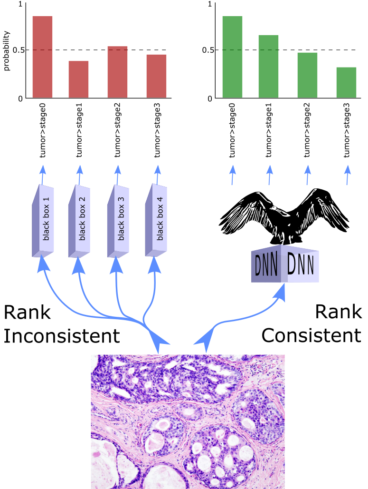

# Condor Ordinal regression in Tensorflow Keras

[](https://github.com/GarrettJenkinson/condor_tensorflow/blob/main/LICENSE)


Tensorflow Keras implementation of CONDOR Ordinal Regression (aka ordinal classification) by 
Garrett Jenkinson et al (2021).

CONDOR is compatible with any state-of-the-art deep neural network architecture, 
requiring only modification of the output layer, the labels, and the loss function.

We also have implemented [CONDOR for pytorch](https://github.com/GarrettJenkinson/condor_pytorch).

This package includes:

  * Ordinal tensorflow loss function: `CondorOrdinalCrossEntropy`
  * Ordinal tensorflow error metric: `OrdinalMeanAbsoluteError`
  * Ordinal tensorflow error metric: `OrdinalEarthMoversDistance`
  * Ordinal tensorflow sparse loss function: `CondorSparseOrdinalCrossEntropy`
  * Ordinal tensorflow sparse error metric: `SparseOrdinalMeanAbsoluteError`
  * Ordinal tensorflow sparse error metric: `SparseOrdinalEarthMoversDistance`
  * Ordinal tensorflow activation function: `ordinal_softmax`
  * Ordinal sklearn label encoder: `CondorOrdinalEncoder`



## Installation

Install the stable version via pip:

```bash
pip install condor_tensorflow
```

Install the most recent code on GitHub via pip:

```bash
pip install git+https://github.com/GarrettJenkinson/condor_tensorflow/
```

## Dependencies

This package relies on Python 3.6+, Tensorflow 2.2+, sklearn, and numpy.
For convenience we provide a Dockerfile that will build a container with
`condor_tensorflow` as well as its dependencies. This can be used
as follows:

```bash
# Create a docker image
docker build -t cpu_tensorflow -f cpu.Dockerfile ./

# run image to serve a jupyter notebook 
docker run -it -p 8888:8888 --rm cpu_tensorflow

# how to run bash inside container (with Python that will have required dependencies available)
docker run -u $(id -u):$(id -g) -it -p 8888:8888 --rm cpu_tensorflow bash
```

Assuming a GPU enabled machine with NVIDIA drivers installed replace `cpu`
above with `gpu`.

## Example

This is a quick example to show basic model implementation syntax.<br>
Example assumes existence of input data X and ordinal labels y.

```python
import tensorflow as tf
import condor_tensorflow as condor
NUM_CLASSES = 5
# Ordinal 'labels' variable has 5 labels, 0 through 4.
enc_labs = condor.CondorOrdinalEncoder(nclasses=NUM_CLASSES).fit_transform(labels)
model = tf.keras.Sequential()
model.add(tf.keras.layers.Dense(32, activation = "relu"))
model.add(tf.keras.layers.Dense(NUM_CLASSES-1)) # Note the "-1"
model.compile(loss = condor.CondorOrdinalCrossEntropy(),
              metrics = [condor.OrdinalMeanAbsoluteError()])
model.fit(x = X, y = enc_labs)
```

[See this colab notebook](https://github.com/GarrettJenkinson/condor_tensorflow/blob/main/docs/CONDOR_TensorFlow_demo.ipynb) 
for extended examples of ordinal regression with MNIST and Amazon reviews (universal sentence encoder).

Please post any issues to the [issue queue](https://github.com/GarrettJenkinson/condor_tensorflow/issues). 

**Acknowledgments**: Many thanks to [the CORAL ordinal authors](https://github.com/ck37/coral-ordinal) and 
[the CORAL pytorch authors](https://github.com/Raschka-research-group/coral_pytorch) whose repos provided a roadmap for this codebase.

## References

Jenkinson, Khezeli, Oliver, Kalantari, Klee. Universally rank consistent ordinal regression in neural networks, TBD, 2022.
